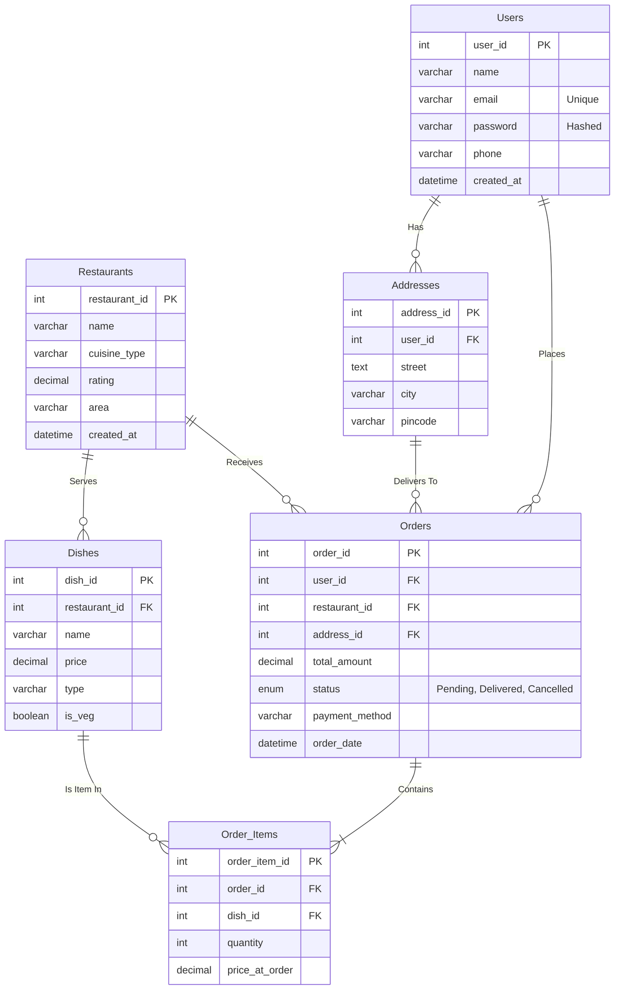

# UrbanZaika - Food Delivery Platform Documentation

This document explains the underlying architecture, data flow, Database schemas, and connectivity handling for the UrbanZaika platform, ignoring frontend visual elements.

---

## 1. Technology Stack Architecture

The UrbanZaika system relies on a monolithic but decoupled 3-tier structure:
1. **Database Layer (MySQL)**: A robust relational MySQL schema storing entities and referential integrity constraints.
2. **Backend Engine (Node.js + Express)**: A lightweight, non-blocking asynchronous REST API responsible for handling frontend requests via routes, managing user session persistence (`express-session`), and compiling dynamic SQL queries.
3. **Frontend Client (Vanilla HTML/JS/CSS)**: Pure static SPA-like rendering, pulling data exclusively from the REST API via asynchronous Javascript `fetch` calls.

---

## 2. Database & Data Integration Flow

### Backend-to-Database Connection
The backend interfaces with the MySQL Database using the industry-standard `mysql2/promise` driver. 
- A Singleton Connection Pool is established in `/config/db.js` providing scalable multiplexing. 
- All SQL transactions leverage **Prepared Statements** (e.g., `execute('SELECT * FROM Users WHERE email = ?', [email])`) preventing SQL injection.

### Frontend-to-Backend Connection
The Frontend never talks to the Database. Instead, it relies on an abstraction script `main.js`:
- Contains `apiFetch()`, a centralized interceptor wrapping over window `fetch()`.
- Automatically injects JSON headers and handles 401 Unauthorized API drops, bouncing malicious requests.

### Typical Order Lifecycle Flow
1. **Catalog View (Frontend)**: Javascript calls `GET /api/restaurants`.
2. **DB Fetch (Backend)**: Express hits `RestaurantController`, triggering `SELECT * FROM Restaurants`.
3. **Cart Memory**: User adds items, cached instantly to browser `localStorage` as `food_cart`.
4. **Checkout Commit**: Frontend sends `POST /api/orders` block containing `dish_id` and array of integers.
5. **DB Insertion**: Backend dynamically executes dual SQL connections inserting the Master Record (`Orders`) recovering the `LAST_INSERT_ID()`, then iterating the array into bulk `Order_Items`.

---

## 3. Entity Relationship (ER) Diagram

Below is the logical Entity-Relationship architecture governing the MySQL relational data constraints:

## 4. Key Entities Breakdown
* **`Users`**: Primary authentication ledger. Enforces constraints natively (`UNIQUE` emails, `NOT NULL` passwords).
* **`Orders` & `Order_Items`**: This follows a classic **Header-Detail relational pattern**. The top level `Orders` retains the subtotal metadata and foreign keys. The items are locked strictly into the `Order_Items` table, locking the `price_at_order` to prevent retroactive invoice corruption.
